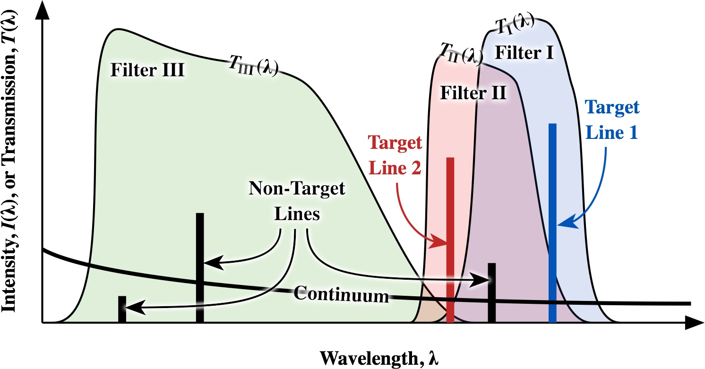

Nebulio
============

A python library to derive emission line ratios from count rates in HST filters

Takes account of overlapping transmission curves and contamination by continuum and non-target lines. 

### About the name

Nebulio is a spanish translation of [Nebulium](http://en.wikipedia.org/wiki/Nebulium), which is a hypothetical chemical element that was once believed to be responsible for strong green and blue emission lines seen in the spectra of astronomical nebulae.  However, it turned out that they were actually due to forbidden lines of singly ionized and doubly ionized oxygen. 

### Installation requirements

Depends on 

1. The [pysynphot](http://stsdas.stsci.edu/pysynphot/) python package.  Install with `pip install pysynphot` or similar.  Tested with version `0.9.5`. 
    * Note that as of writing the released version of `pysynphot` does not work with Python 3, and hence this package requires Python 2 (recommended 2.7).

2. [CDBS database](http://www.stsci.edu/hst/observatory/crds/cdbs_throughput.html).
For nebulio we  only *need* the files in [`synphot1.tar.gz`](http://www.stsci.edu/ftp/cdbs/tarfiles/synphot1.tar.gz).  In theory, that link should always point to the latest version.  The files `synphot<N>.tar.gz` with `<N> = 2 ⟶ 6` are not necessary unless you want to use the spectral synthesis features of pysynphot. 
    * To use nebulio it is necessary to set the `PSYN_CDBS` environment variable to the name of the directory (folder) where you have installed the database files.  
